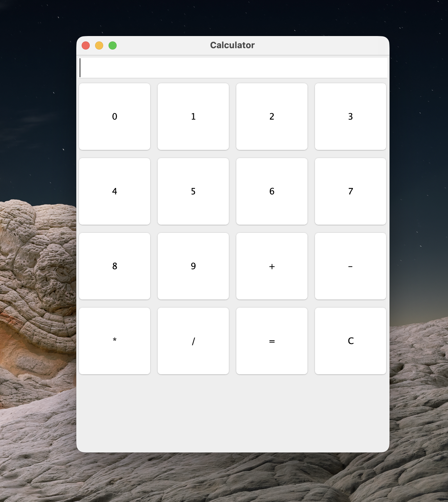

# 電卓アプリケーション（Java Swing）

## 1. 概要

本プロジェクトは、Java Swingを使用して開発したシンプルな電卓アプリケーションです。
GUIアプリケーション開発の基礎およびMVC（Model-View-Controller）アーキテクチャの理解を目的として作成しました。

---

## 2. 機能

* 四則演算

    * 加算（+）
    * 減算（-）
    * 乗算（*）
    * 除算（/）
* クリア機能（Cボタン）
* エラーハンドリング

    * 例：0での除算時にエラー表示

---

## 3. アーキテクチャ

本アプリケーションはMVCパターンに基づいて設計されています。

* Model：計算処理（ロジック）を担当
* View：ユーザーインターフェース（画面）を担当
* Controller：入力処理およびModelとViewの連携を担当

```
calculator/
 ├── model/
 │    └── CalculatorModel.java
 ├── view/
 │    └── CalculatorView.java
 ├── controller/
 │    └── CalculatorController.java
 └── Main.java
```

---

## 4. 開発環境

* 言語：Java（JDK 17以上）
* GUIライブラリ：Swing
* IDE：IntelliJ IDEA / Visual Studio Code

---

## 5. 実行方法

1. 本リポジトリをクローンします

```
git clone https://github.com/your-username/java-swing-calculator.git
```

2. プロジェクトをIDEで開きます

3. 以下のファイルを実行してください

```
Main.java
```

---

## 6. 実行画面

### Calculator


---

## 7. 工夫した点

* MVCアーキテクチャを採用し、責務ごとにクラスを分割しました。
* ロジックとUIを分離することで、保守性の向上を意識しました。
* イベント処理にラムダ式を使用し、コードの簡潔化を図りました。
* 例外処理（0除算）を実装し、安定した動作を意識しました。

---

## 8. 課題・今後の改善点

* 小数点入力機能の追加
* UIデザインの改善
* キーボード入力対応
* 科学計算機能（平方根、三角関数など）の追加

---

## 9. 学習ポイント

* Java SwingによるGUI開発の基礎
* MVCパターンの設計と実装
* イベント駆動プログラミング（Event-driven programming）
* 可読性を意識したコード設計

---

## 10. 作成者

Tony

---

## 11. 補足（Optional）

本プロジェクトは学習目的で作成したものです。
今後はSpring Bootなどを用いたバックエンド開発にも取り組む予定です。
